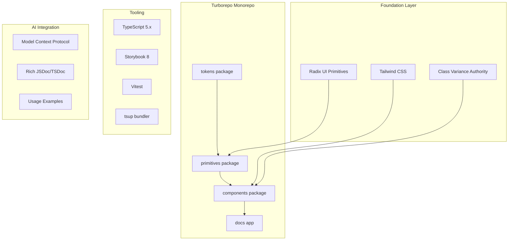

# Design System Tech Stack Research - Claude Opus 4.5

## User Request

Research the best tech stack for a design system. The system will be used to power a SaaS web application for the energy industry, written in TypeScript. The design system will be used by AIs (Figma Make, Cursor, others) so availability to LLMs is a big plus.

---

## Research Findings

### Key Recommendations from Web Research

**1. Frontend Framework: React with TypeScript**
- React's component-based architecture promotes reusability and maintainability
- TypeScript enhances code quality with static typing
- This combination is prevalent among SaaS startups due to scalability and strong community support

**2. Component Library: Radix UI**
- Unstyled, accessible React components
- Can be customized to fit your design system
- Ensures accessibility and provides a solid foundation

**3. Design Tool Integration: Figma Make with Model Context Protocol (MCP)**
- Figma Make: AI-powered tool for rapid prototyping and design system generation
- MCP: Open-source standard facilitating integration between AI tools and design platforms
- Allows AI models to access design context and code components

**4. Deployment: Vercel**
- Platform optimized for Next.js applications
- Seamless deployment, scalability, and performance monitoring

**5. AI Integration: Cursor and Figma MCP**
- Cursor integrates with Figma via MCP
- Enables AI models to read and modify designs programmatically
- Enhances design-to-code workflow

---

## Clarifying Questions & Answers

**Q: What is the scope of the design system?**
A: Full design system (tokens, primitives, complex components, patterns)

**Q: How important is Figma design-to-code synchronization?**
A: Nice to have - Basic Figma compatibility is enough

---

## Recommended Stack Overview



### Implementation Todos

1. Initialize Turborepo monorepo with pnpm workspaces
2. Create tokens package with CSS variables and Tailwind config
3. Create primitives package with Radix UI foundation
4. Create components package with CVA-based styled components
5. Configure Storybook 8 for documentation and visual testing
6. Add JSDoc, usage examples, and AI-friendly documentation

---

## Tailwind CSS Analysis

### Pros

| Advantage | Why It Matters for Your Use Case |
|-----------|----------------------------------|
| **LLM Familiarity** | Tailwind is extremely well-represented in LLM training data. AI tools like Cursor, Copilot, and Figma Make generate Tailwind code with high accuracy. |
| **Utility-First = Predictable** | Classes like `px-4`, `text-sm`, `bg-primary` are self-documenting. LLMs can reason about them easily. |
| **Design Token Integration** | Tailwind's config file (`tailwind.config.ts`) maps directly to design tokens. You define `colors.primary`, and get `bg-primary`, `text-primary`, `border-primary` automatically. |
| **No CSS Naming Debates** | No BEM, no CSS Modules naming conventions to enforce. Reduces cognitive load for humans and AIs alike. |
| **Excellent TypeScript Support** | With `tailwind-merge` and `clsx`, you get type-safe className composition. CVA (Class Variance Authority) adds typed variants. |
| **Small Bundle Size** | PurgeCSS removes unused styles. Production builds are tiny. |
| **Industry Standard** | Used by Vercel, Shopify, Netflix, and most modern SaaS companies. Easy to hire developers who know it. |

### Cons

| Disadvantage | Mitigation |
|--------------|------------|
| **Verbose Class Strings** | Long className strings like `"flex items-center justify-between px-4 py-2 bg-white rounded-lg shadow-sm"` can be hard to read. **Mitigation**: Use CVA to encapsulate variants into component APIs. |
| **Learning Curve** | Developers need to learn Tailwind's utility naming conventions. **Mitigation**: IDE extensions (Tailwind IntelliSense) provide autocomplete. |
| **Tight Coupling to HTML** | Styles live in markup, not separate files. Makes some refactoring harder. **Mitigation**: Component abstraction - styles are in the component file, not scattered across pages. |
| **Design Token Rigidity** | Changing a token means updating `tailwind.config.ts` and rebuilding. **Mitigation**: Use CSS variables for runtime theming, Tailwind for static utilities. |
| **Not True CSS-in-JS** | Can't do truly dynamic styles based on props (like `width: ${props.width}px`). **Mitigation**: Use inline styles or CSS variables for dynamic values. |

### Alternatives Considered

| Alternative | Verdict |
|-------------|---------|
| **CSS Modules** | Good isolation, but less AI-friendly (arbitrary class names). Lower LLM accuracy. |
| **Styled Components / Emotion** | Runtime CSS-in-JS has performance overhead. Less LLM training data. Bundle size concerns. |
| **Vanilla Extract** | Zero-runtime, type-safe. But smaller community, less LLM familiarity. |
| **Panda CSS** | Modern, type-safe, good DX. But newer = less LLM training data, smaller ecosystem. |

### Recommendation for AI-Friendly Design Systems

The hybrid approach works best:

```
CSS Variables (runtime theming)
       ↓
Tailwind Config (static utilities)
       ↓
CVA (component variants)
       ↓
Component API (what consumers use)
```

This gives you:
- **CSS Variables**: Runtime theme switching (dark mode, white-labeling)
- **Tailwind**: Predictable utilities that LLMs understand
- **CVA**: Clean component APIs that hide the utility complexity

---

## Summary

For an AI-friendly design system powering a TypeScript SaaS application:

| Layer | Technology | Rationale |
|-------|------------|-----------|
| Monorepo | Turborepo + pnpm | Fast builds, caching, workspace management |
| Framework | React 18+ | Best LLM training data, largest ecosystem |
| Language | TypeScript 5.x | Type safety, better AI code generation |
| Primitives | Radix UI | Accessible, unstyled, composable |
| Styling | Tailwind CSS + CSS Variables | AI-friendly, design token support |
| Variants | Class Variance Authority (CVA) | Type-safe component variants |
| Documentation | Storybook 8 | Interactive docs, visual testing |
| Build | tsup | Fast TypeScript bundling |
| Testing | Vitest + React Testing Library | Fast, modern testing |
| AI Integration | MCP, JSDoc, Examples | LLM accessibility |

